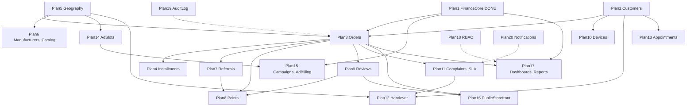

# خارطة طريق Backend لمنصة واتفيل (Master Roadmap)

> **مصدر الحقيقة في Git:** هذا الملف يُزامَن مع المستودع — استخدمه من أي لابتوب عبر `git pull`.  
> **للمتابعة في Cursor:** `@docs/BACKEND_ROADMAP.md نفّذ Plan 2` أو افتح `.cursor/plans/BACKEND_ROADMAP.plan.md`  
> **الخطوة التالية:** Plan 2 — العملاء والهوية

تحويل وثيقة المميزات الكاملة إلى خطط Backend مرقّمة قابلة للتنفيذ بالتتابع. النطاق: **Backend/API فقط** + **توثيق عقود API** (OpenAPI/Postman) لكل موديول.

## الوضع الحالي (الأساس)
- منفّذ: Auth بدورين (`super_admin`/`company`)، CRUD للشركات/الموردين/المنتجات، كتالوج، خطط تقسيط على مستوى المنتج، محافظات (`governorates` فيها `name_ar`/`name_en` فقط).
- **الخطة 1 (Finance Core) مكتملة**: `wallet_transactions` + `wallet_transaction_meta`، `commission_rules` + `commission_events` (مع دعم الإعفاءات)، `withdrawal_requests` + `withdrawal_audits`، خدمات `WalletPostingService`/`CommissionService`/`WithdrawalService`، وPolicies واختبارات.
- الناقص: كل ما هو "تشغيل أعمال" بعد الكتالوج (طلبات، عملاء، إحالات، نقاط، شكاوى، إعلانات، جغرافيا عميقة، تقارير، حوكمة).

## مبادئ عامة (Cross-cutting) تنطبق على كل خطة
- لكل موديول: Migrations + Models + Services + FormRequests + Policies + Resources + Routes + اختبارات (happy/failure) — حسب Definition of Done في تقرير الفجوات.
- أي حركة مالية تمر عبر `WalletPostingService` (لا تعديل مباشر على `wallet_balance`).
- العمليات المالية/الطلبات تستخدم `idempotency_key` + `DB::transaction` + `lockForUpdate`.
- نمط الاستجابة الموحّد: `{ data, meta }` للقوائم و`{ message, data }` للطفرات (نفس النمط الحالي).
- **عقد API**: كل خطة تُنتج إضافات إلى مجموعة Postman + ملف OpenAPI تحت مجلد `docs/api/` لتسليمها لفرق الواجهات.

## مخطط التبعيات بين الموديولات

---

## المرحلة A — نواة التجارة (حرجة)

### Plan 2: العملاء والهوية (Customers)
- يغطي: قسم 12.1، وأساس لمعظم الموديولات.
- جداول: `customers`, `customer_profiles`, `customer_company_links` (ربط العميل بالشركة/المتجر).
- Auth: guard/provider جديد للعميل عبر Sanctum (مثل النمط الحالي للشركة)، تسجيل/دخول/ملف.
- APIs: تسجيل عميل، دخول، ملف، قائمة عملاء الشركة.
- تبعية: لا شيء (بعد الأساس الحالي).

### Plan 3: الطلبات ودورة الحياة (Orders)
- يغطي: 1 (العمولة عند التنفيذ)، 3.1، 5.1، 9.1.
- جداول: `orders`, `order_items`, `order_status_history`, `order_sources` (إعلان/إحالة/رابط/مباشر).
- منطق: آلة حالات (`pending/processing/completed/cancelled`)، عند `completed` يُستدعى `CommissionService::apply()` تلقائياً (الربط الناقص حالياً)، إسناد المصدر يحدد الإعفاء.
- APIs: إنشاء/عرض/قائمة/تحديث حالة (شركة + أدمن لمراقبة الطلبات).
- تبعية: Plan 2، Plan 1، (Plan 5 لإسناد الجغرافيا).

### Plan 4: عقود التقسيط والتحصيل (Installment Contracts)
- يغطي: 3.2 (تفاصيل الأقساط)، 9.2.
- جداول: `installment_contracts`, `installment_schedule`, `installment_payments`, `installment_penalties`.
- منطق: إنشاء عقد عند طلب بالتقسيط مع snapshot لشروط الخطة (من `company_product_installment_plans`)، توليد جدول استحقاق، تسجيل تحصيل (كامل/جزئي/متأخر)، Jobs للتذكير ومراقبة التأخر، ترحيل التحصيل للمحفظة/الدفتر.
- تبعية: Plan 3.

---

## المرحلة B — الجغرافيا وعمق الكتالوج

### Plan 5: التوسع الجغرافي (Geography)
- يغطي: 2.2، 4.9، 5.6، 11.1.
- جداول: `cities` (تابعة لـ `governorates`)، `coverage_zones`/مناطق، `company_coverage` (تغطية الشركة بالمدن)، `company_branches` + `branch_working_hours` + `branch_exceptions`.
- APIs: إدارة مدن (أدمن)، تحديد تغطية الشركة، عرض شركات حسب محافظة/مدينة، عدد الشركات لكل مدينة.
- تبعية: لا شيء (توسعة للموجود).

### Plan 6: المصنّعون وتحسينات الكتالوج (Manufacturers & Catalog)
- يغطي: 4.6، 4.7، 5.3.
- جداول: `manufacturers` (تانك/سول ووتر/درمين...)، حقول SEO وصور احترافية على المنتجات، `product_geo_placements` (محافظات/مدن العرض)، حالة موافقة المنتج (`pending/approved/rejected`)، مزامنة التصدير للمتاجر.
- APIs: مصنّعون CRUD (أدمن)، موافقة منتجات، تفعيل/إخفاء، تحديد مكان العرض، تصدير/مزامنة.
- تبعية: Plan 5.

---

## المرحلة C — النمو والولاء

### Plan 7: محرك الإحالات (Referrals)
- يغطي: 3.4، 4.2 (تعويض 5 قروش/نقطة)، أساس روابط 4.3/4.4.
- جداول: `referral_links` (لكل شركة/حملة)، `referral_events`, `referral_rewards`.
- منطق: توليد أكواد/روابط، نافذة إسناد ومنع تلاعب، شرط المكافأة (أول طلب مكتمل = 500 نقطة)، ترحيل المكافأة لنقاط/محفظة، تعويض الشركة المستقبِلة (5 قروش/نقطة) عبر `WalletPostingService`.
- تبعية: Plan 3، (Plan 8 للنقاط).

### Plan 8: النقاط والمكافآت (Points & Rewards)
- يغطي: 2.3، 3.1 (سجل النقاط)، 5.5، 6، 11.6.
- جداول: `points_wallets`, `points_ledger`, `rewards_catalog`, `points_redemptions`.
- منطق: مصادر متعددة (200 تسجيل، 1/جنيه شراء، 500 إحالة)، انتهاء صلاحية، استبدال، إعدادات قابلة للضبط من الأدمن (5.5)، **اشتراط التقييم قبل صرف النقاط** (تكامل مع Plan 9).
- تبعية: Plan 3، Plan 7، Plan 9.

### Plan 9: التقييمات والترتيب (Reviews & Ranking)
- يغطي: 2.1 (ترتيب حسب التقييم)، 3.6، 10، 8 (ترتيب).
- جداول: `reviews`, تجميع تقييم على الشركة، `ranking_scores` لكل مدينة.
- منطق: تقييم إلزامي يفتح صرف النقاط، خوارزمية ترتيب الشركات لكل مدينة (تقييم + أداء).
- تبعية: Plan 3.

---

## المرحلة D — تشغيل الخدمة

### Plan 10: أجهزة العميل والصيانة (Devices & Maintenance)
- يغطي: 3.2 (ملف فني)، أساس 2.5.
- جداول: `customer_devices` (مشتراة + خارجية)، `device_maintenance_schedule`، مواصفات وأقساط مرتبطة.
- تبعية: Plan 2، (Plan 4 لربط الأقساط).

### Plan 11: الشكاوى وSLA (Complaints & SLA)
- يغطي: 3.3، 4 (الشكاوى)، 7.1.
- جداول: `support_tickets`, `support_ticket_messages`, `support_ticket_attachments`, `support_sla_logs`.
- منطق: آلة حالات للتذاكر، احتساب SLA ومنه **مهلة 72 ساعة**، تصعيد تلقائي عبر Jobs.
- تبعية: Plan 3.

### Plan 12: التنازل عن العملاء وسوق الاستحواذ (Handover)
- يغطي: 3.5، 4.5، 4.8، 7.
- جداول: `customer_handovers` (سبب/حالة/مهلة)، سوق العملاء المتاحين، إحالة خارج التغطية.
- منطق: مهلة 72 ساعة قبل التنازل، نقل كامل نقاط العميل، تعويض الشركة المتنازلة من محفظة المستحوِذة، عمولة إحالة محددة (مثل 200 جنيه).
- تبعية: Plan 2، Plan 5، Plan 11، Plan 8.

### Plan 13: حجز المواعيد مع الخبراء (Appointments)
- يغطي: 2.5.
- جداول: `appointments` (عميل/شركة/فرع/وقت/حالة).
- تبعية: Plan 2، (Plan 5 للفروع).

---

## المرحلة E — تحقيق الدخل (الإعلانات)

### Plan 14: مخزون الإعلانات والمزادات (Ad Slots & Pricing)
- يغطي: 5.2، 8، 11.2، 12.3 (إدارة المزادات).
- جداول: `ad_slots` (3 مراكز/أولوية لكل محافظة/مدينة)، `ad_slot_pricing` (تسعير حسب الجغرافيا)، `ad_reservations`.
- منطق: أولوية الدفع تحدد المركز، تحقق السعة/التداخل.
- تبعية: Plan 5.

### Plan 15: الحملات والتتبع وفوترة الإعلان (Campaigns & Ad Billing)
- يغطي: 4.3، 4.4، 5.2.
- جداول: `campaigns`, `campaign_creatives`, `campaign_clicks`, `campaign_conversions`.
- منطق: دورة حملة (إنشاء/اعتماد/نشر/إيقاف)، روابط تتبع وإسناد، خصم التكلفة من المحفظة عبر `WalletPostingService`، **إعفاء العمولة** للعملاء عبر روابط خارجية (موجود أصلاً في `CommissionService`) وعمولة ثابتة لروابط المتجر (4.4).
- تبعية: Plan 14، Plan 1، (Plan 3 للتحويلات).

---

## المرحلة F — واجهات عامة ولوحات

### Plan 16: واجهات المتجر العامة والمفضلة (Public Storefront)
- يغطي: 2.1، 2.2، 2.4، 2.6.
- جداول: `favorites`, `store_visit_history`.
- APIs عامة (بدون auth أو auth عميل): استكشاف الشركات حسب الجغرافيا والترتيب، مقارنة منتجات، endpoint لحاسبة التقسيط، مفضلة، سجل المتاجر.
- تبعية: Plan 5، Plan 9، (Plan 2 للمفضلة).

### Plan 17: لوحات المؤشرات والتقارير (Dashboards & Reporting)
- يغطي: 4 (تقارير الأداء)، 5.1، 5.4، 10.
- APIs: KPIs للشركة (طلبات/تحصيلات/متأخرات/إحالات/شكاوى/رصيد)، KPIs للأدمن (أداء الشركات/SLA/مالي/حملات)، تجميع بمدى زمني، تصدير CSV/XLS.
- تبعية: Plan 3، Plan 1 (وبقية الموديولات حسب المتاح).

---

## المرحلة G — الحوكمة والموثوقية

### Plan 18: RBAC تفصيلي
- يغطي: 5.6، 12.3.
- جداول: `roles`, `permissions`, `model_has_roles`, `model_has_permissions` (يُفضّل spatie/laravel-permission)، صلاحيات نطاقية (territory/company scope، مدير منطقة).

### Plan 19: سجل التدقيق (Audit Log)
- جداول: `audit_logs` (actor/target/before-after/IP). ربط بالعمليات الحساسة في كل موديول.

### Plan 20: محرك الإشعارات (Notifications)
- يغطي: 3.3، 7.1، 11.5.
- جداول: `notification_templates`, `notification_queue`, `notification_logs`؛ قنوات in-app/email/SMS/WhatsApp؛ dispatch مدفوع بالأحداث.

### Plan 21: عقود API وتقوية الموثوقية (Contracts & Hardening)
- توحيد OpenAPI/Postman النهائي، Idempotency/Locks/Retries حيث ينقص، Webhooks موقّعة، نقاط تكامل بوابات الدفع/المراسلة.

---

## ترتيب التنفيذ المقترح (الأولوية)
1. المرحلة A (2 → 3 → 4): بدونها لا يوجد تشغيل فعلي ولا عمولة فعلية.
2. المرحلة B (5 → 6): الجغرافيا والكتالوج يفتحان الطلبات الجغرافية والإعلانات.
3. المرحلة C (7 → 8 → 9): النمو والولاء.
4. المرحلة D (10 → 11 → 12 → 13): تشغيل الخدمة.
5. المرحلة E (14 → 15): تحقيق الدخل.
6. المرحلة F (16 → 17): الواجهات والتقارير.
7. المرحلة G (18 → 19 → 20 → 21): الحوكمة والتسليم النهائي.

## ملاحظات ومخاطر
- بعض الميزات تعتمد على بعضها بقوة (النقاط ↔ الإحالات ↔ التقييم ↔ التنازل)؛ الالتزام بالتبعيات يقلل إعادة العمل.
- العمولة "عند التنفيذ" فعلياً لن تعمل حتى تكتمل Plan 3 (ربط `completed` بـ `CommissionService`).
- خطط الحوكمة (18-19) يُفضّل البدء بأساسها مبكراً (هياكل audit/permission) حتى لو اكتمل تفعيلها لاحقاً.